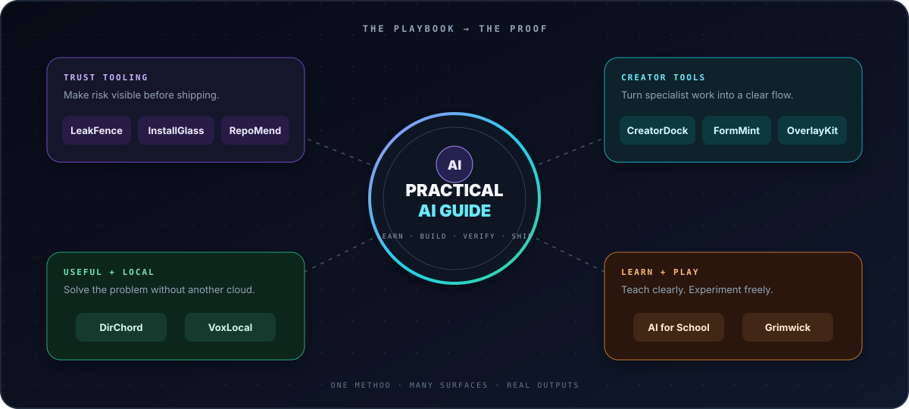

<picture>
  <source media="(prefers-color-scheme: dark)" srcset="assets/hero-dark.svg">
  <source media="(prefers-color-scheme: light)" srcset="assets/hero-light.svg">
  
</picture>

<p align="center">
  <a href="https://github.com/RepoEnjoyer?tab=repositories"></a>
  <a href="https://github.com/RepoEnjoyer/AI-Guide"></a>
  <a href="https://github.com/RepoEnjoyer?tab=achievements"></a>
</p>

<p align="center">
  <strong>Builder of privacy-first tools, calm interfaces, practical guides, and software that respects the person using it.</strong>
</p>

---

## Welcome to the workshop

I turn annoying, risky, or confusing workflows into software that feels obvious.

The projects here range from repository safety and package inspection to creative workspaces, 3D model preflight, browser-native accessibility tools, and field guides for using AI responsibly. Different surfaces; one philosophy:

> **Keep the power. Remove the friction. Respect the user.**

<p align="center">
  
</p>

## Flagship systems

<table>
  <tr>
    <td width="50%" valign="top">
      <h3><a href="https://github.com/RepoEnjoyer/LeakFence">🛡️ LeakFence</a></h3>
      <p><strong>Catch private information before it becomes public.</strong></p>
      <p>A local scanner for identity leaks, credentials, risky files, Git history, and hidden document metadata. Findings are reported without printing the sensitive values.</p>
      <p><code>Node.js</code> <code>CLI</code> <code>SARIF</code> <code>zero runtime dependencies</code></p>
    </td>
    <td width="50%" valign="top">
      <h3><a href="https://github.com/RepoEnjoyer/InstallGlass">🔬 InstallGlass</a></h3>
      <p><strong>See what an npm install tried to do.</strong></p>
      <p>Runs package installation inside a disposable Docker sandbox and records filesystem, process, network, environment, and native-artifact activity for review.</p>
      <p><code>Node.js</code> <code>Docker</code> <code>strace</code> <code>security tooling</code></p>
    </td>
  </tr>
  <tr>
    <td width="50%" valign="top">
      <h3><a href="https://github.com/RepoEnjoyer/RepoMend">🩺 RepoMend</a></h3>
      <p><strong>A deterministic doctor for repositories.</strong></p>
      <p>Diagnoses Git state, author privacy, dependency health, workflow risks, documentation gaps, community files, Pages configuration, and CI status.</p>
      <p><code>TypeScript</code> <code>CLI</code> <code>GitHub Actions</code> <code>privacy-safe reports</code></p>
    </td>
    <td width="50%" valign="top">
      <h3><a href="https://github.com/RepoEnjoyer/FormMint">🧊 FormMint</a></h3>
      <p><strong>Private model preflight for Roblox accessories.</strong></p>
      <p>Inspects real GLB, GLTF, and OBJ files for topology, bounds, UV, material, texture, skinning, and complexity problems—and prepares a reversible cleaned copy.</p>
      <p><code>3D web</code> <code>GLTF</code> <code>local-first</code> <code>geometry analysis</code></p>
    </td>
  </tr>
  <tr>
    <td width="50%" valign="top">
      <h3><a href="https://github.com/RepoEnjoyer/CreatorDock">🎛️ CreatorDock</a></h3>
      <p><strong>A calm workspace from loose idea to published work.</strong></p>
      <p>Keeps briefs, hooks, production checklists, deadlines, reference links, and reusable workflows together—without accounts, analytics, or a backend.</p>
      <p><code>TypeScript</code> <code>Vite</code> <code>PWA</code> <code>accessible UI</code></p>
    </td>
    <td width="50%" valign="top">
      <h3><a href="https://github.com/RepoEnjoyer/OverlayKit">⚡ OverlayKit</a></h3>
      <p><strong>Transparent performance overlays without injection.</strong></p>
      <p>A small header-only C++20 toolkit for DPI-aware Win32 overlays, hardware-rendered draw lists, telemetry panels, and engine-owned D3D12/Vulkan adapters.</p>
      <p><code>C++20</code> <code>DirectX 11</code> <code>Win32</code> <code>header-only</code></p>
    </td>
  </tr>
</table>

## The rest of the constellation

| Project | What it unlocks | Character |
|---|---|---|
| [The Practical AI Guide](https://github.com/RepoEnjoyer/AI-Guide) | 17 practical chapters, labs, templates, safety guidance, and fast routes into useful AI work | `education` `open reference` |
| [AI for School](https://github.com/RepoEnjoyer/AI-For-School) | Assignment-first AI workflows built around integrity, evidence, privacy, and proof of work | `students` `responsible AI` |
| [DirChord](https://github.com/RepoEnjoyer/DirChord) | Deterministic folder manifests and local comparisons for changed, missing, moved, or duplicate files | `TypeScript` `SHA-256` `CLI` |
| [VoxLocal](https://github.com/RepoEnjoyer/Vox-Local) | Browser-native text to speech using voices already installed on the device | `Web Speech API` `accessible` |
| [Grimwick](https://github.com/RepoEnjoyer/Grimwick) | A playable web-game experiment | `game` `web` `play` |

<details>
<summary><strong>Why these projects belong together</strong></summary>

They all reduce a particular kind of distance:

- **LeakFence, InstallGlass, and RepoMend** reduce the distance between “probably safe” and evidence.
- **CreatorDock and FormMint** reduce the distance between an idea and a finishable workflow.
- **DirChord and VoxLocal** reduce the distance between a useful capability and the person who needs it.
- **The AI guides** reduce the distance between hype and practical judgment.
- **OverlayKit and Grimwick** keep the workshop playful and technically curious.

</details>

## Build DNA

<table>
  <tr>
    <td align="center" width="20%"><strong>LOCAL FIRST</strong><br><sub>Keep data close whenever the job allows it.</sub></td>
    <td align="center" width="20%"><strong>SAFE DEFAULTS</strong><br><sub>Make the careful path the easy path.</sub></td>
    <td align="center" width="20%"><strong>EXPLAIN THE WHY</strong><br><sub>Useful output beats mysterious scores.</sub></td>
    <td align="center" width="20%"><strong>REVERSIBLE</strong><br><sub>Preview, inspect, undo, and stay in control.</sub></td>
    <td align="center" width="20%"><strong>ZERO THE FRICTION</strong><br><sub>Fewer accounts, services, and hidden steps.</sub></td>
  </tr>
</table>

## Toolbox

<p>
  
  
  
  
  
  
  
  
  
</p>

```text
favorite loop

notice friction  →  map the real risk  →  build the smallest honest tool
       ↑                                             ↓
       └──────────── test · explain · refine · ship ─┘
```

## Current direction

- Building sharper privacy and supply-chain guardrails for everyday developers.
- Turning expert workflows into interfaces a first-time user can understand.
- Writing documentation that gets readers to a useful result quickly.
- Exploring local browser capabilities, graphics, automation, and delightful small tools.

## Start somewhere good

| If you are... | Open this first |
|---|---|
| publishing a repository | [LeakFence](https://github.com/RepoEnjoyer/LeakFence) → [RepoMend](https://github.com/RepoEnjoyer/RepoMend) |
| evaluating an npm package | [InstallGlass](https://github.com/RepoEnjoyer/InstallGlass) |
| learning practical AI | [The Practical AI Guide](https://github.com/RepoEnjoyer/AI-Guide) |
| using AI for coursework | [AI for School](https://github.com/RepoEnjoyer/AI-For-School) |
| organizing creative work | [CreatorDock](https://github.com/RepoEnjoyer/CreatorDock) |
| preparing a 3D accessory | [FormMint](https://github.com/RepoEnjoyer/FormMint) |

<p align="center">
  
</p>

<p align="center">
  <sub>Everything public here is built and presented under the <strong>RepoEnjoyer</strong> identity.</sub>
</p>
