  <a href="https://github.com/search?q=author%3ARepoEnjoyer&amp;type=commits&amp;s=committer-date&amp;o=desc"><strong>Daily commits ↗</strong></a> &nbsp; / &nbsp;
  <a href="#built-to-go-deeper">Selected work</a> &nbsp; / &nbsp;
  <a href="https://github.com/RepoEnjoyer/AI-Guide">The AI Guide</a> &nbsp; / &nbsp;
  <a href="#how-i-think-about-software">Working principles</a> &nbsp; / &nbsp;
  <a href="https://github.com/RepoEnjoyer?tab=repositories">All repositories ↗</a>

  

<strong>THE SPARK</strong> &nbsp; · &nbsp; HolyC, Terry Davis, and the curiosity to build your own world.

  

 

## Curiosity runs deep.

I'm **RepoEnjoyer**. I build tools that make hidden behavior easier to inspect: what a package does during installation, what a repository accidentally reveals, and what a graphics layer needs to stay small and predictable.

My work spans **developer tooling, privacy, native graphics, and practical AI education**. I use AI throughout the build process, with a particular interest in the decisions that still need human judgment: scope, architecture, failure modes, and whether the result is useful.

I like a good abstraction. I like knowing what it hides even more.

 

## Built to go deeper

<table>
<tr>
<td width="50%" valign="top">

### 01 / [InstallGlass](https://github.com/RepoEnjoyer/InstallGlass)
**What actually happens during `npm install`?**

An instrumented Docker sandbox that observes installation behavior and produces reviewable evidence: file activity, child processes, network destinations, and native artifacts.

PACKAGE BEHAVIOR &nbsp; · &nbsp; NODE.JS / DOCKER / STRACE

</td>
<td width="50%" valign="top">

### 02 / [LeakFence](https://github.com/RepoEnjoyer/LeakFence)
**Your source code can reveal more than secrets.**

A local scanner for credentials, identity leaks, Git author details, and document metadata. Findings explain the problem without echoing the sensitive value.

PRIVACY ENGINEERING &nbsp; · &nbsp; NODE.JS / CLI / SARIF

</td>
</tr>
<tr>
<td width="50%" valign="top">

### 03 / [OverlayKit](https://github.com/RepoEnjoyer/OverlayKit)
**A small window into a running system.**

A header-only C++20 toolkit for transparent Win32 overlays and performance HUDs. DirectX 11 rendering, a renderer-neutral draw list, and explicit resource ownership.

NATIVE GRAPHICS &nbsp; · &nbsp; C++20 / WIN32 / DIRECTX 11

</td>
<td width="50%" valign="top">

### 04 / [RepoMend](https://github.com/RepoEnjoyer/RepoMend)
**The repository is part of the product.**

A deterministic repository doctor for Git state, dependency health, workflow risks, privacy, and documentation. Readable findings with a useful next action.

DEVELOPER EXPERIENCE &nbsp; · &nbsp; TYPESCRIPT / GIT / CI

</td>
</tr>
</table>

 

## The playbook is open.

**[The Practical AI Guide](https://github.com/RepoEnjoyer/AI-Guide)** is where I organize the methods behind the work: prompting, coding agents, local models, context engineering, evaluation, and the distance between a prototype and something people can use.

[Start reading ↗](https://github.com/RepoEnjoyer/AI-Guide/blob/main/START_HERE.md) &nbsp; · &nbsp; [Explore the labs](https://github.com/RepoEnjoyer/AI-Guide/tree/main/labs) &nbsp; · &nbsp; [Use the templates](https://github.com/RepoEnjoyer/AI-Guide/tree/main/templates)

For a different kind of machine, there's **[HolyC Handbook](https://github.com/RepoEnjoyer/HolyC-Handbook)**: a source-first guide to programming inside TempleOS, from the language model to memory, graphics, and small runnable programs.

 

## How I think about software

- **Make behavior inspectable.** A finding should explain what happened and where to look next.
- **Design the failure path.** Limits, partial results, and recovery belong in the design.
- **Keep control close to the user.** Prefer local processing and reversible changes when the problem allows them.
- **Write down the reasoning.** Good documentation preserves the decisions, not just the commands.

<strong>A few other directions worth exploring</strong>

 

| Project | The question behind it |
| :--- | :--- |
| [FormMint](https://github.com/RepoEnjoyer/FormMint) | Can 3D asset inspection happen in a private browser workspace? |
| [CreatorDock](https://github.com/RepoEnjoyer/CreatorDock) | Can a creative workflow stay useful without accounts or a backend? |
| [DirChord](https://github.com/RepoEnjoyer/DirChord) | What changed between two folders, and how can we verify it? |
| [VoxLocal](https://github.com/RepoEnjoyer/Vox-Local) | How much can speech tools do with voices already on the device? |

 

  

Explore a repository. Read the design decisions. Try to break an assumption.

