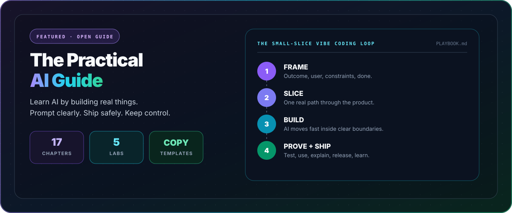
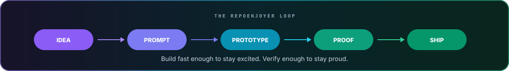

<picture>
  <source media="(prefers-color-scheme: dark)" srcset="assets/hero-dark.svg?rain=1">
  <source media="(prefers-color-scheme: light)" srcset="assets/hero-light.svg?rain=1">
  
</picture>

<h1 align="center">I vibe-code useful things, then document the playbook.</h1>

<p align="center">
  <strong>Privacy-first tools · ambitious experiments · practical AI education · well-documented releases</strong>
</p>

<p align="center">
  <a href="https://github.com/RepoEnjoyer/AI-Guide"></a>
  <a href="https://github.com/RepoEnjoyer?tab=repositories"></a>
  <a href="https://github.com/RepoEnjoyer?tab=achievements"></a>
</p>

---

## ⭐ Featured project: The Practical AI Guide

<a href="https://github.com/RepoEnjoyer/AI-Guide">
  
</a>

<p align="center">
  <a href="https://github.com/RepoEnjoyer/AI-Guide/blob/main/START_HERE.md"></a>
  <a href="https://github.com/RepoEnjoyer/AI-Guide/blob/main/guide/04-vibe-coding.md"></a>
  <a href="https://github.com/RepoEnjoyer/AI-Guide/tree/main/templates"></a>
  <a href="https://github.com/RepoEnjoyer/AI-Guide/tree/main/labs"></a>
</p>

**[The Practical AI Guide](https://github.com/RepoEnjoyer/AI-Guide)** is the project at the center of this profile. It teaches the same method I use to turn a rough idea into a real repository: frame the outcome, give AI useful context, build one inspectable slice, test what matters, and ship with documentation.

It is built for people who want to **use AI well**, not memorize buzzwords. Inside are 17 focused chapters, five hands-on labs, copy-ready prompts, project templates, local-AI guidance, coding-agent workflows, privacy checks, and a complete route from first prompt to production.

> [!TIP]
> If you only open one page, make it the **[vibe coding chapter](https://github.com/RepoEnjoyer/AI-Guide/blob/main/guide/04-vibe-coding.md)**. It shows how to keep AI fast without letting a project become fragile or impossible to understand.

## The loop behind the repos

| Stage | The question I answer | What comes out |
|---|---|---|
| **01 · Frame** | What useful result should exist when this is done? | outcome, user, constraints, definition of done |
| **02 · Slice** | What is the smallest end-to-end version worth testing? | one real vertical feature instead of a giant scaffold |
| **03 · Build** | What context and tools let AI move without guessing? | clear files, decisions, examples, and bounded permissions |
| **04 · Prove** | What would show this actually works and is safe? | tests, manual checks, privacy review, failure paths |
| **05 · Ship** | Can a stranger understand, run, and trust it? | documentation, clean setup, honest limits, useful defaults |

## The playbook in production

AI-Guide explains the method. These projects put it under real constraints: private data, untrusted packages, complex files, specialist workflows, native graphics, and people who just want the tool to make sense.

Every spotlight below follows the same rule: **move fast, keep the work inspectable, and ship something a stranger can actually use.**

<table>
  <tr>
    <td width="50%" valign="top">
      <h3><a href="https://github.com/RepoEnjoyer/LeakFence">🛡️ LeakFence</a></h3>
      <p><strong>Catch private information before it becomes public.</strong></p>
      <p>A local scanner for identity leaks, credentials, risky files, Git history, and hidden metadata. It reports the problem without printing the sensitive value.</p>
      <p><code>Node.js</code> <code>CLI</code> <code>SARIF</code> <code>zero runtime dependencies</code></p>
    </td>
    <td width="50%" valign="top">
      <h3><a href="https://github.com/RepoEnjoyer/InstallGlass">🔬 InstallGlass</a></h3>
      <p><strong>See what an npm install tried to do.</strong></p>
      <p>Runs package installation inside a disposable Docker sandbox and records filesystem, process, network, environment, and native-artifact activity.</p>
      <p><code>Node.js</code> <code>Docker</code> <code>strace</code> <code>supply-chain security</code></p>
    </td>
  </tr>
  <tr>
    <td width="50%" valign="top">
      <h3><a href="https://github.com/RepoEnjoyer/RepoMend">🩺 RepoMend</a></h3>
      <p><strong>Find out why a repository is not ready to ship.</strong></p>
      <p>A deterministic repository doctor for Git state, author privacy, dependency health, workflow risks, documentation, community files, Pages, and CI.</p>
      <p><code>TypeScript</code> <code>CLI</code> <code>GitHub Actions</code> <code>privacy-safe reports</code></p>
    </td>
    <td width="50%" valign="top">
      <h3><a href="https://github.com/RepoEnjoyer/FormMint">🧊 FormMint</a></h3>
      <p><strong>Private model preflight for Roblox accessories.</strong></p>
      <p>Inspects GLB, GLTF, and OBJ files for topology, bounds, UV, material, texture, skinning, and complexity problems, then prepares a reversible cleaned copy.</p>
      <p><code>3D web</code> <code>GLTF</code> <code>local-first</code> <code>geometry analysis</code></p>
    </td>
  </tr>
  <tr>
    <td width="50%" valign="top">
      <h3><a href="https://github.com/RepoEnjoyer/CreatorDock">🎛️ CreatorDock</a></h3>
      <p><strong>A calm workspace from loose idea to published work.</strong></p>
      <p>Organizes briefs, hooks, checklists, deadlines, references, and reusable workflows without accounts, analytics, advertising, or a backend.</p>
      <p><code>TypeScript</code> <code>Vite</code> <code>PWA</code> <code>accessible UI</code></p>
    </td>
    <td width="50%" valign="top">
      <h3><a href="https://github.com/RepoEnjoyer/OverlayKit">⚡ OverlayKit</a></h3>
      <p><strong>Transparent performance overlays without injection.</strong></p>
      <p>A header-only C++20 toolkit for DPI-aware Win32 overlays, hardware-rendered draw lists, telemetry panels, and D3D12/Vulkan adapters.</p>
      <p><code>C++20</code> <code>DirectX 11</code> <code>Win32</code> <code>header-only</code></p>
    </td>
  </tr>
</table>

## More from the build log

| Repository | Why it exists | Lane |
|---|---|---|
| [AI for School](https://github.com/RepoEnjoyer/AI-For-School) | Stronger schoolwork with integrity, evidence, privacy, and proof of authorship | `responsible AI` |
| [DirChord](https://github.com/RepoEnjoyer/DirChord) | Deterministic folder manifests and local comparisons for changed, missing, moved, or duplicate files | `TypeScript` `SHA-256` |
| [VoxLocal](https://github.com/RepoEnjoyer/Vox-Local) | Private browser-native text to speech using voices already installed on the device | `Web Speech API` `accessibility` |
| [Grimwick](https://github.com/RepoEnjoyer/Grimwick) | A playable web-game experiment because useful builders should still make weird, fun things | `game` `web` |

<details>
<summary><strong>How the portfolio fits together</strong></summary>

- **AI-Guide** explains the method.
- **LeakFence, InstallGlass, and RepoMend** turn “probably safe” into inspectable evidence.
- **CreatorDock and FormMint** turn specialist workflows into calm, finishable interfaces.
- **DirChord and VoxLocal** use local capabilities to solve ordinary problems without another account.
- **OverlayKit and Grimwick** keep the work technically ambitious and playful.
- **AI for School** applies the same practical, safety-aware thinking to students.

</details>

## Build principles

<table>
  <tr>
    <td align="center" width="20%"><strong>LOCAL FIRST</strong><br><sub>Keep data close when the task allows it.</sub></td>
    <td align="center" width="20%"><strong>SMALL SLICES</strong><br><sub>Build one real path before expanding.</sub></td>
    <td align="center" width="20%"><strong>VISIBLE PROOF</strong><br><sub>Tests and explanations beat mystery scores.</sub></td>
    <td align="center" width="20%"><strong>REVERSIBLE</strong><br><sub>Preview, inspect, undo, and stay in control.</sub></td>
    <td align="center" width="20%"><strong>HONEST LIMITS</strong><br><sub>Say what the software cannot guarantee.</sub></td>
  </tr>
</table>

## Toolbox

<p align="center">
  
  
  
  
  
  
  
</p>

```text
rough idea
   └─> clear outcome
         └─> smallest useful slice
               └─> AI-assisted build
                     └─> tests + real use
                           └─> documented project
                                 └─> lessons added back to the playbook
```

## Pick your route

| You want to... | Start here |
|---|---|
| learn to vibe code without creating a mess | **[Vibe coding chapter](https://github.com/RepoEnjoyer/AI-Guide/blob/main/guide/04-vibe-coding.md)** |
| learn practical AI from the beginning | **[AI-Guide: Start Here](https://github.com/RepoEnjoyer/AI-Guide/blob/main/START_HERE.md)** |
| check a repository before publishing | **[LeakFence](https://github.com/RepoEnjoyer/LeakFence)** → **[RepoMend](https://github.com/RepoEnjoyer/RepoMend)** |
| investigate an npm package safely | **[InstallGlass](https://github.com/RepoEnjoyer/InstallGlass)** |
| organize a creative project | **[CreatorDock](https://github.com/RepoEnjoyer/CreatorDock)** |
| prepare a Roblox accessory model | **[FormMint](https://github.com/RepoEnjoyer/FormMint)** |



<p align="center">
  <sub>Built and published as <strong>RepoEnjoyer</strong>.</sub>
</p>
